# FDE: The $1M/Year AI Job Explained — slide notes

- **Source:** https://www.youtube.com/watch?v=zXysLUTLjw4 (51:34)
- **Show:** The Startup Ideas Podcast — Greg Isenberg, with Vas (@vasuman, CEO of Varick Agents, prev. AI @ Meta)
- **Topic:** What a Forward Deployed Engineer (FDE) is, why the role commands high pay, and Varick's 30-day plan for breaking into it
- **Companion:** [transcript.md](transcript.md) — full timestamped transcript. Timestamps below jump to the moment each slide appears.

Deck: "Varick's Guide to AI Forward Deployed Engineering — the blueprint to breaking into FDE in 30 days."

---

## Part 1 — Why the FDE role exists

### [00:00:25] Every company can now buy intelligence
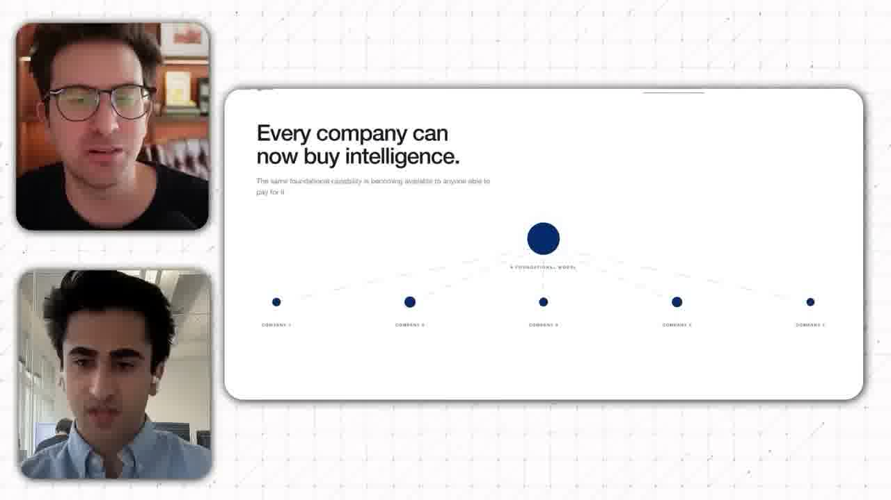
"The same foundational capability is becoming available to anyone able to pay for it." Diagram: one foundational model feeding Companies A–E equally.

### [00:00:27] Intelligence alone cannot be the moat
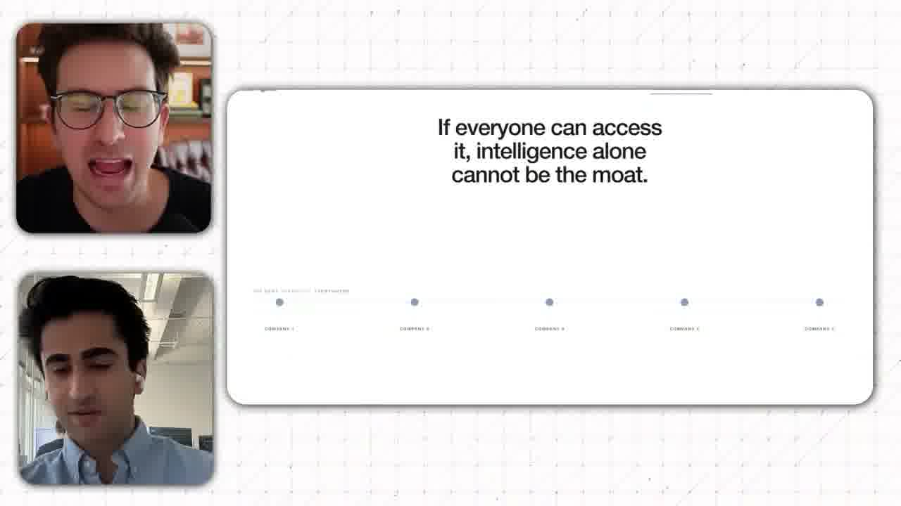
"If everyone can access it, intelligence alone cannot be the moat."

### [00:02:03] Deck title
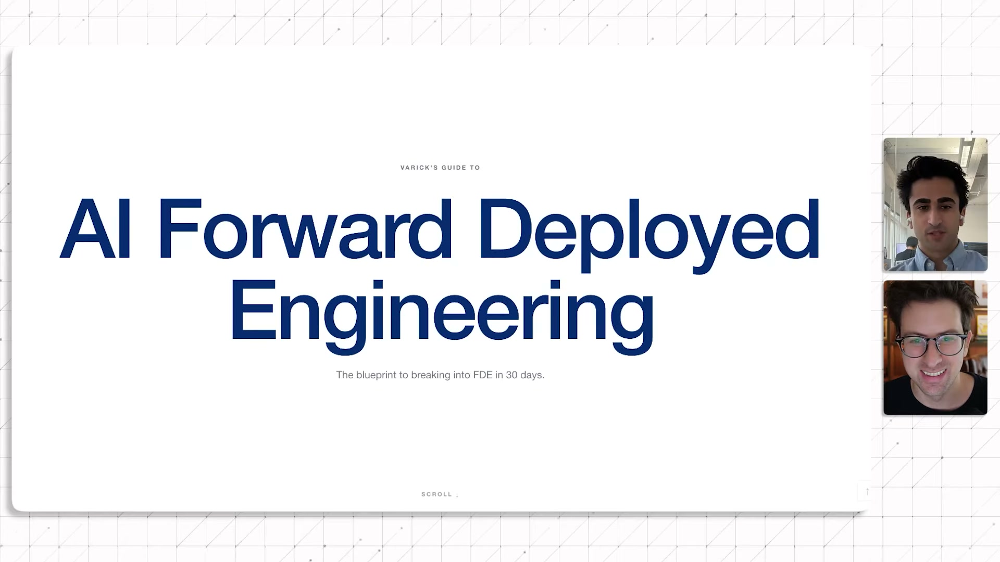
"Varick's Guide to AI Forward Deployed Engineering — The blueprint to breaking into FDE in 30 days."

### [00:06:16] The edge moved into deployment
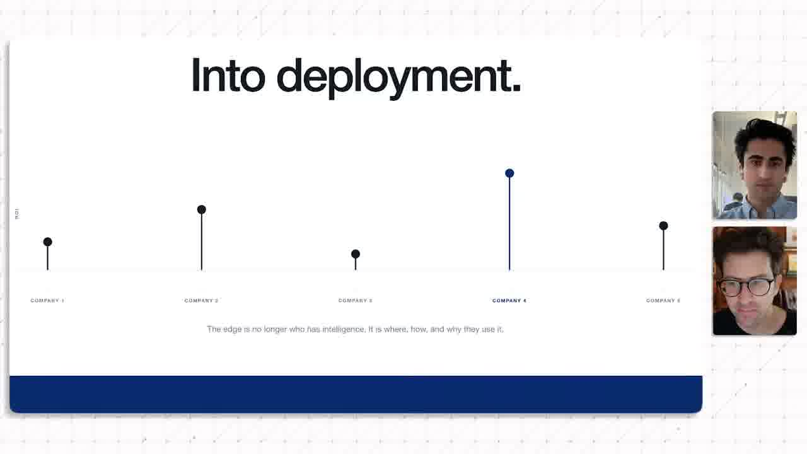
Chart of Companies 1–5 with one outlier: "The edge is no longer who has intelligence. It is where, how, and why they use it."

### [00:06:16] Someone has to decide where intelligence belongs
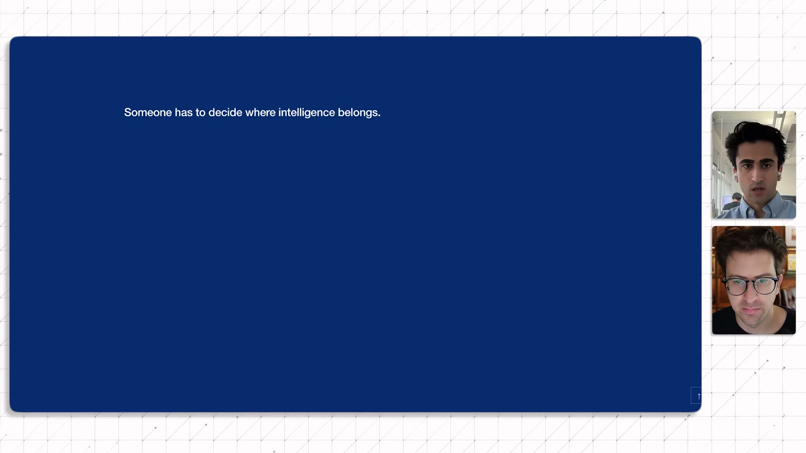
Single-line slide; sets up the role definition. (On screen through ~14:58 while they discuss.)

### [00:14:58] That person is the forward deployed engineer
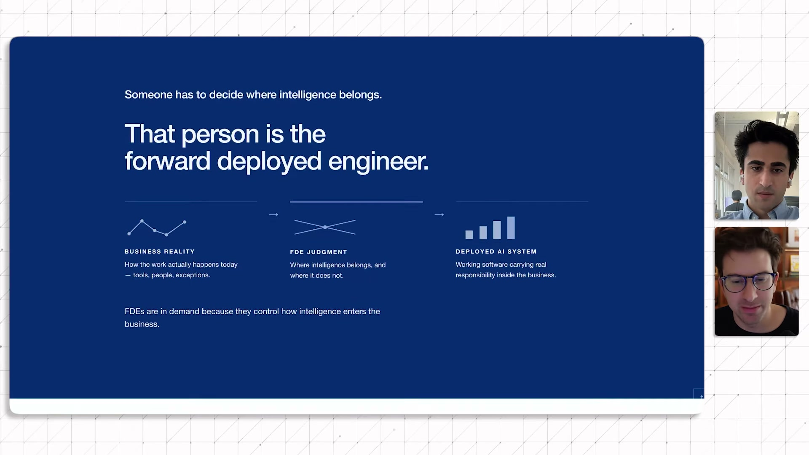
Three-column definition: **Business reality** (how the work actually happens today — tools, people, exceptions) → **FDE judgment** (where intelligence belongs, and where it does not) → **Deployed AI system** (working software carrying real responsibility inside the business). "FDEs are in demand because they control how intelligence enters the business."

## Part 2 — Understanding the real workflow (the audit mindset)

### [00:17:33] How the work is really being done
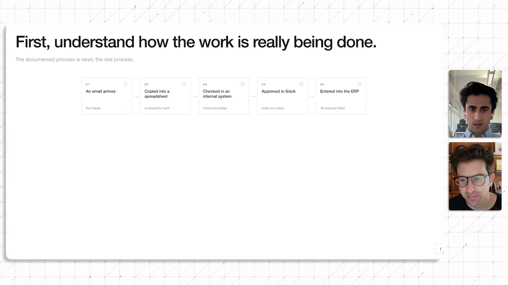
"The documented process is rarely the real process." Five-step example workflow: 01 An email arrives (the trigger) → 02 Copied into a spreadsheet (re-keyed by hand) → 03 Checked in an internal system (tribal knowledge) → 04 Approved in Slack (exists as a reply) → 05 Entered into the ERP (30 required fields). "The FDE traces every step — the 'simple' version hides the real work."

### [00:17:48] Step 01 detail — "An email arrives"
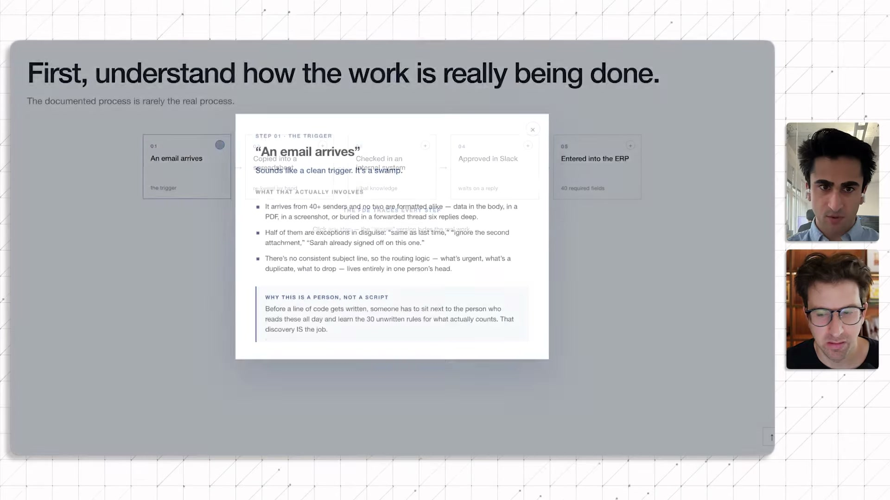
"Sounds like a clean trigger. It's a swamp." 40+ senders, no two formatted alike — data in the body, a PDF, a screenshot, or a forwarded thread six replies deep. Half are exceptions in disguise ("same as last time," "ignore the second attachment," "Sarah already signed off"). Routing logic lives entirely in one person's head. **Why this is a person, not a script:** someone has to sit next to the person who reads these all day and learn the 30 unwritten rules. That discovery IS the job.

### [00:19:16] Step 02 detail — "Copied into a spreadsheet"
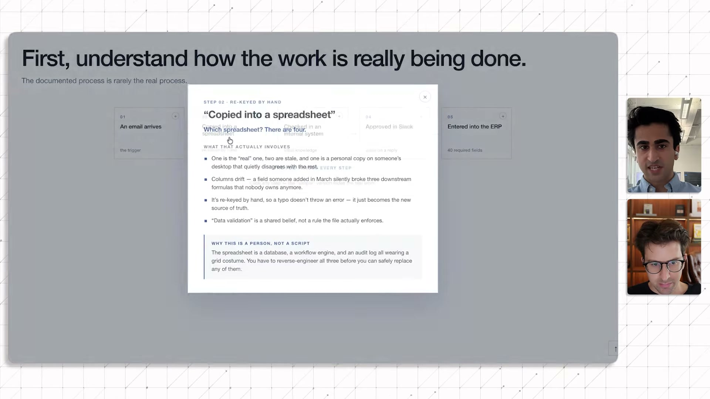
"Which spreadsheet? There are four." One real, two stale, one personal desktop copy that quietly disagrees. Columns drift; a typo doesn't throw an error — it becomes the new source of truth; "data validation" is a shared belief, not an enforced rule. **Why a person:** the spreadsheet is a database, a workflow engine, and an audit log wearing a grid costume — reverse-engineer all three before replacing any.

### [00:19:26] Step 03 detail — "Checked in an internal system"
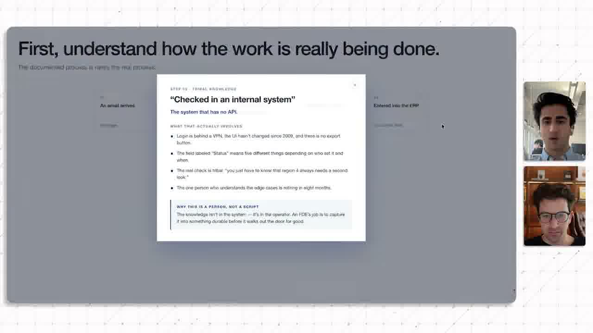
"The system that has no API." Behind a VPN, UI unchanged since 2009, no export button. "Status" means five different things. The real check is tribal ("region 4 always needs a second look"). The one person who understands the edge cases retires in eight months. **Why a person:** the knowledge is in the operator, not the system — capture it before it walks out the door.

### [00:20:17] Interactive demo — one run, end to end
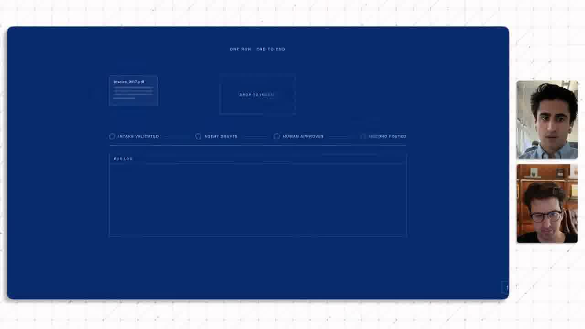
Demo screen: drop `invoice_0417.pdf` to ingest → INTAKE VALIDATED → AGENT DRAFTS → HUMAN APPROVES → RECORD POSTED, with a run log. Illustrates a deployed system carrying a real workflow with human approval in the loop.

## Part 3 — The job: Audit → Evals → Deployment

### [00:27:08] The job has three parts
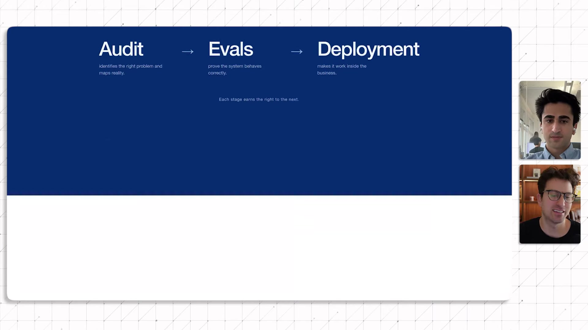
**Audit** identifies the right problem and maps reality. **Evals** prove the system behaves correctly. **Deployment** makes it work inside the business. "Each stage earns the right to the next."

### [00:27:36] Audit: find the workflow worth rebuilding
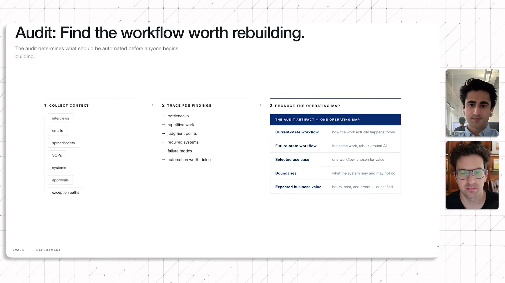
Collect context (interviews, emails, spreadsheets, SOPs, systems, approvals, exception paths) → trace findings (bottlenecks, repetitive work, judgment points, required systems, failure modes, automation worth doing) → produce **the operating map**: current-state workflow, future-state workflow rebuilt around AI, one selected use case chosen for value, boundaries (what the system may and may not do), and expected business value quantified in hours, cost, and errors.

### [00:31:25] Decide what should be automated — and what should not
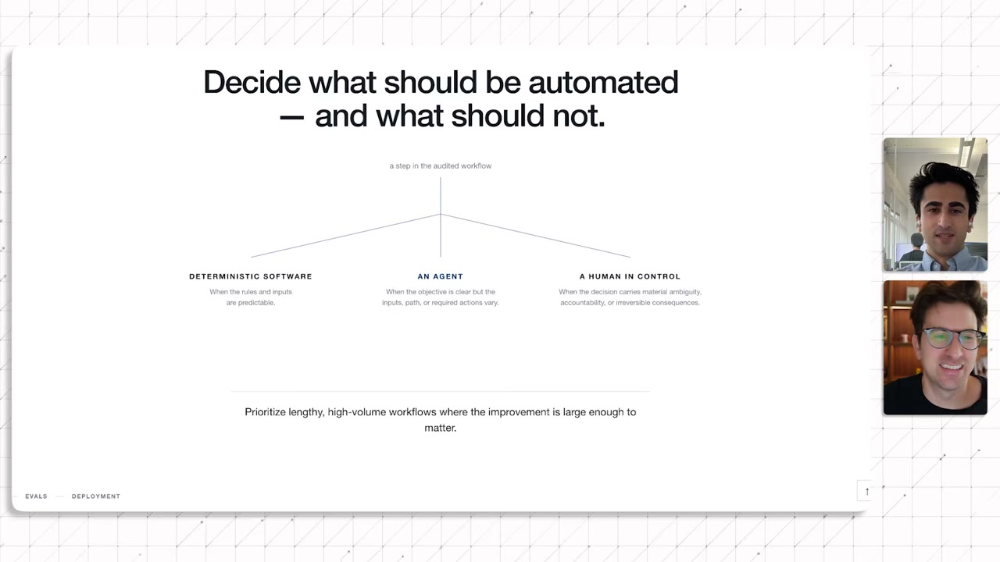
Each step routes to one of three: **deterministic software** (rules and inputs predictable), **an agent** (objective clear but inputs/path/actions vary), or **a human in control** (material ambiguity, accountability, or irreversible consequences). "Prioritize lengthy, high-volume workflows where the improvement is large enough to matter."

### [00:32:10] Evals: turn non-determinism into evidence
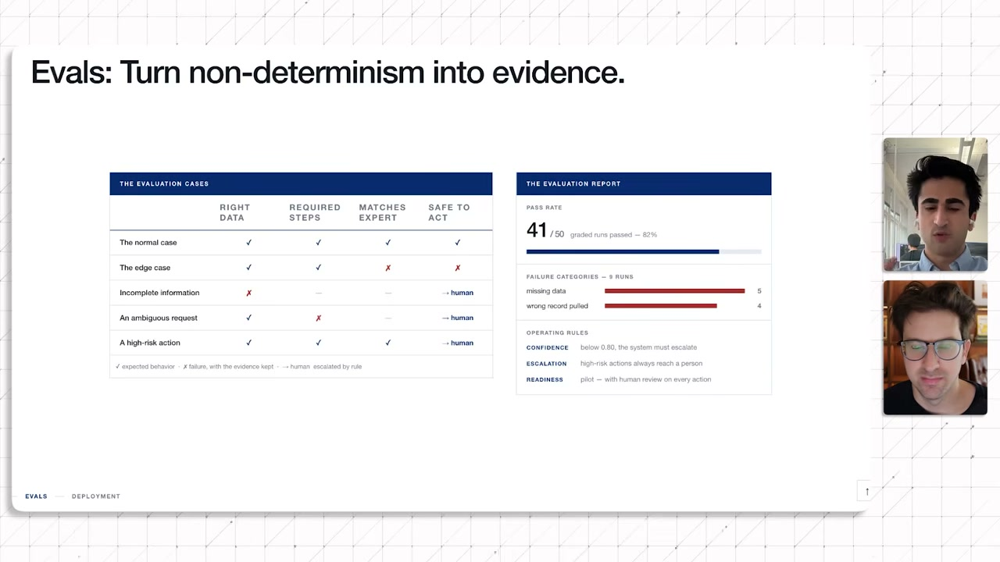
Evaluation cases graded on: right data, required steps, matches expert, safe to act — across the normal case, the edge case, incomplete information (→ human), an ambiguous request (→ human), a high-risk action (→ human). Example evaluation report: 41/50 runs passed (82%); failure categories "missing data" (5) and "wrong record pulled" (4); operating rules — below 0.80 confidence the system must escalate; high-risk actions always reach a person; readiness: pilot with human review on every action.

### [00:32:57] Deployment: make it work inside the business
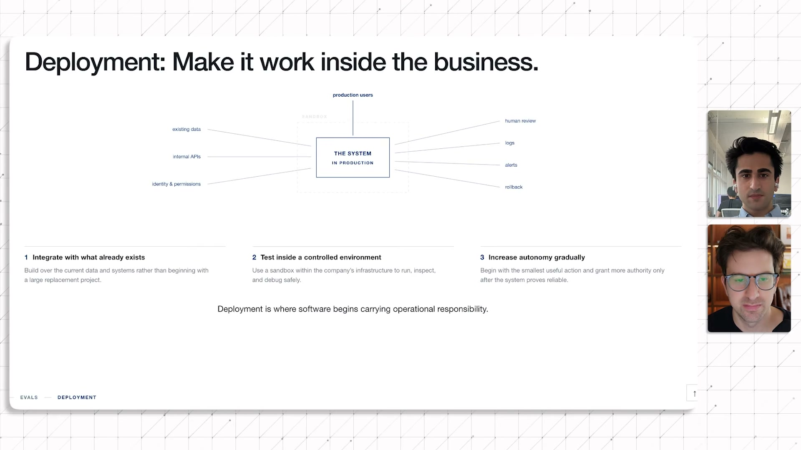
The system in production connects to existing data, internal APIs, identity & permissions, human review, logs, alerts, rollback. 1) Integrate with what already exists — build over current systems, not a big replacement project. 2) Test inside a controlled environment — a sandbox in the company's infrastructure. 3) Increase autonomy gradually — smallest useful action first; more authority only after the system proves reliable. "Deployment is where software begins carrying operational responsibility."

### [00:38:12] The loop
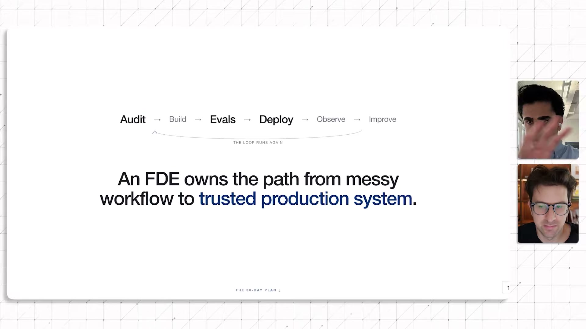
Audit → Build → Evals → Deploy → Observe → Improve, then the loop runs again. "An FDE owns the path from messy workflow to trusted production system."

## Part 4 — The 30-day plan

### [00:39:09] Roadmap overview
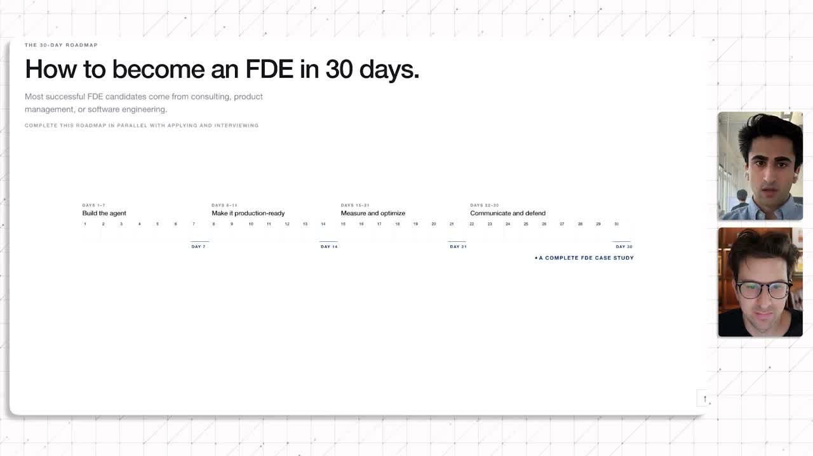
"Most successful FDE candidates come from consulting, product management, or software engineering." Complete the roadmap **in parallel with applying and interviewing**. Days 1–7 build the agent · 8–14 make it production-ready · 15–21 measure and optimize · 22–30 communicate and defend.

### [00:39:55] Week 1 (days 1–7): build an agent that can complete a real loop
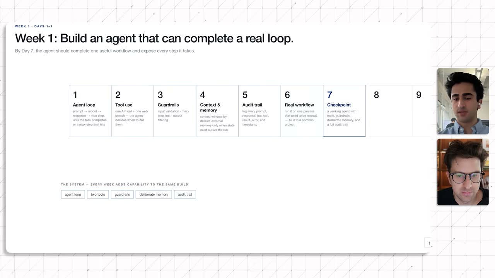
1 Agent loop (prompt → model → response → next step, until done or max-step limit) · 2 Tool use (one API call + one web search; the agent decides when) · 3 Guardrails (input validation, max-step limit, output filtering) · 4 Context & memory (context window by default; external memory only when state must outlive the run) · 5 Audit trail (log every prompt, response, tool call, result, error, timestamp) · 6 Real workflow (one process that used to be manual — tie to a portfolio project) · 7 Checkpoint: a working agent with tools, guardrails, deliberate memory, full audit trail.

### [00:42:10] Week 2 (days 8–14): turn the demo into a system that can recover
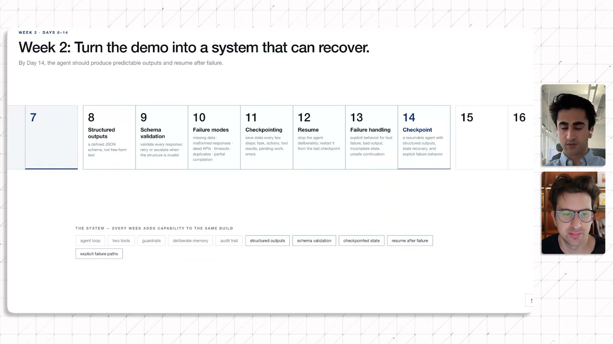
8 Structured outputs (defined JSON schema, not free-form text) · 9 Schema validation (validate every response; retry or escalate on invalid structure) · 10 Failure modes (missing data, malformed responses, dead APIs, timeouts, duplicates, partial completion) · 11 Checkpointing (save state every few steps) · 12 Resume (stop deliberately; restart from last checkpoint) · 13 Failure handling (explicit behavior for tool failure, bad output, incomplete state, unsafe continuation) · 14 Checkpoint: a resumable agent with structured outputs, state recovery, explicit failure behavior.

### [00:43:40] Week 3 (days 15–21): make it measurable and economically viable
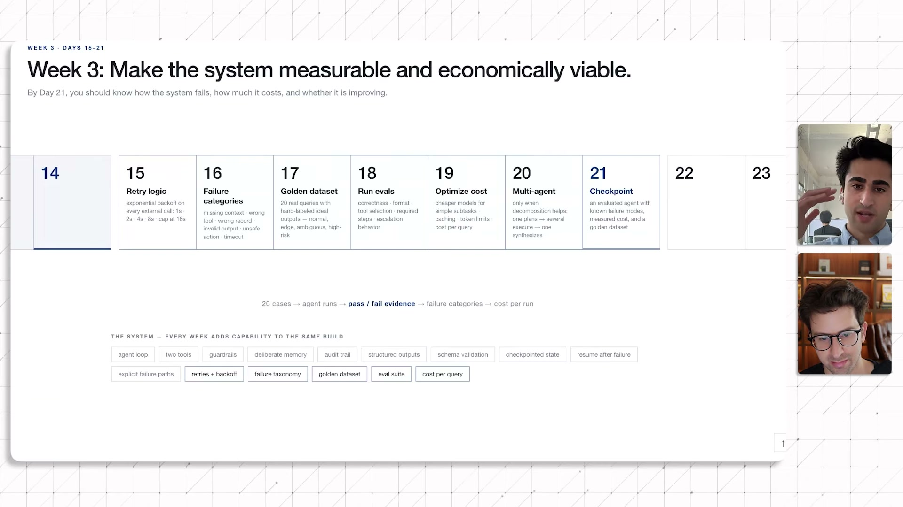
15 Retry logic (exponential backoff: 1s·2s·4s·8s, cap 16s) · 16 Failure categories (missing context, wrong tool, wrong record, invalid output, unsafe action, timeout) · 17 Golden dataset (20 real queries with hand-labeled ideal outputs — normal, edge, ambiguous, high-risk) · 18 Run evals (correctness, format, tool selection, required steps, escalation behavior) · 19 Optimize cost (cheaper models for simple subtasks, caching, token limits, cost per query) · 20 Multi-agent (only when decomposition helps: one plans → several execute → one synthesizes) · 21 Checkpoint: an evaluated agent with known failure modes, measured cost, a golden dataset.

### [00:44:25] Final week (days 22–30): defend the system like an FDE
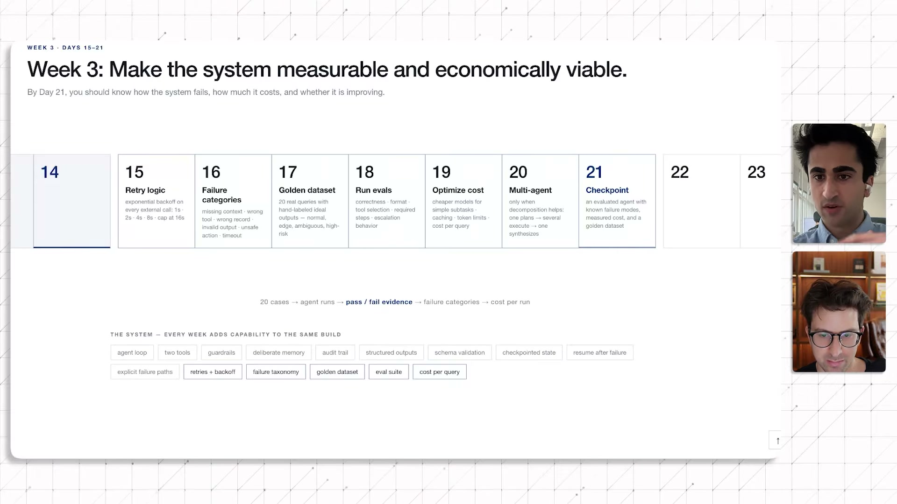
22 The pain point (who does the work, what takes time, where errors occur, what it costs) · 23 Why AI belongs (why not just software; what stays human; where autonomy stops) · 24 Architecture (stack, tools, models, data, memory, guardrails — and why each exists) · 25 Iterations (what v1 got wrong, what failed, what changed) · 26 The evals (dataset, pass rate, failure categories, thresholds, open risks) · 27 Economics (time saved, errors reduced, risk, revenue, cost per query) · 28 Rehearse for an engineer (architecture, decisions, failures, tradeoffs) · 29 Rehearse for a VP (problem, outcome, evidence, risk — plain language) · 30 Final checkpoint: a complete FDE case study for engineers and executives alike.

### [00:45:55] Do the job before you have the title
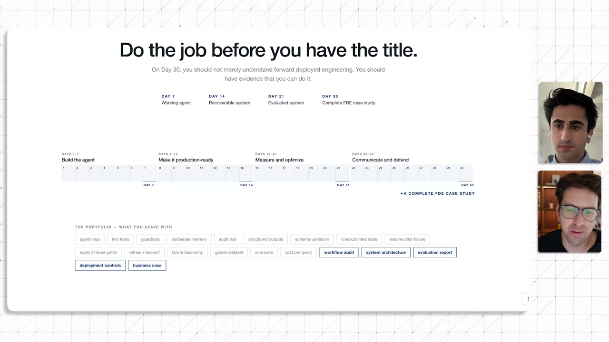
"On Day 30, you should not merely understand forward deployed engineering. You should have evidence that you can do it." Milestones: Day 7 working agent · Day 14 recoverable system · Day 21 evaluated system · Day 30 complete FDE case study. The portfolio: agent loop, two tools, guardrails, deliberate memory, audit trail, structured outputs, schema validation, checkpointed state, resume after failure, explicit failure paths, retries + backoff, failure taxonomy, golden dataset, eval suite, cost per query — plus workflow audit, system architecture, evaluation report, deployment controls, business case.

## Outro

### [00:50:34] Guest contact
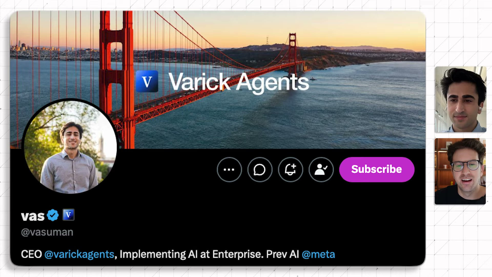
X profile shown on screen: @vasuman — "CEO @varickagents, Implementing AI at Enterprise. Prev AI @meta."

---

*Extraction notes: slides captured from the video via scene detection plus 45-second sampling of low-motion sections; text transcribed from frames and cross-checked against the audio transcript. Auto-captions frequently mis-hear "FDE" as "FTE" and "Varick" as "Veric" — the slide text above is the authoritative spelling.*
